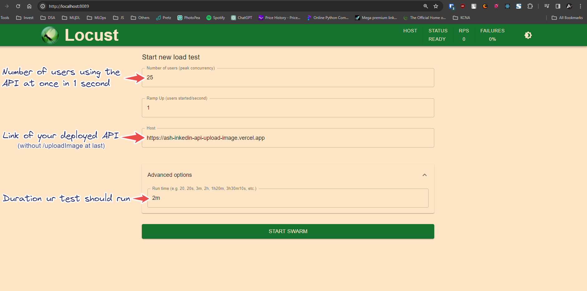

Steps for Performance Testing using Locust

1. Install `locust` python package using command:
   
   `pip install locust`

2. Update contentUrl and headers in the `test_locust.py` file:
   
   ```python
   payload = {
       'contentUrl': '//ff22307d23eb9d2dd90f452e2e1d6f9.cdn.bubble.io/f1705957170658x141430425408167310/fake_note.png'
       }
   headers = {
     'Authorization': 'Bearer <auth_token>',
     'Upload-Url': '<linkedin_upload_url>'
   }
   ```

3. Start the Locust server: 
   
   `locust -f test_locust.py`

4. Open Locust in browser at following link: http://localhost:8089/

5. Set number of users and duration of your test and Run the test using `Start Swarm` Button
   
   


